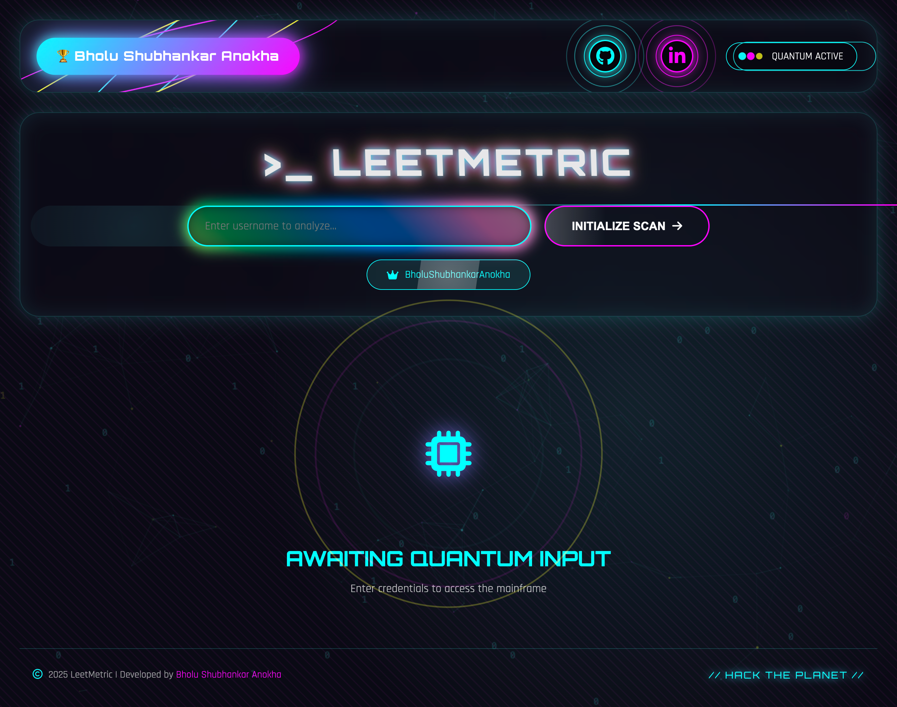
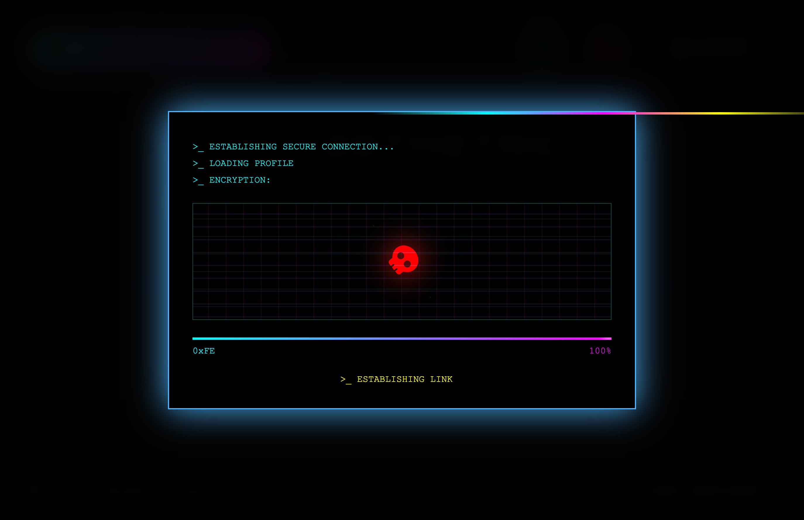

# LeetMetric 📊

LeetMetric is a simple JavaScript web application that tracks and displays LeetCode user statistics in a clean and responsive dashboard.
This project fetches and visualizes LeetCode user data to help track coding progress and performance.  
It was built to strengthen my understanding of JavaScript, API handling, and DOM manipulation.

## 🚀 Live Demo
(Add your live link here if deployed)

## 🛠 Tech Stack

- HTML  
- CSS
- JavaScript  

## 👨‍💻 Author

**Bholu Shubhankar Anokha**  
B.Tech – Artificial Intelligence & Data Science  

## 📬 Connect With Me

- 🔗 **LinkedIn** – [Bholu Shubhankar Anokha](https://www.linkedin.com/in/bholushubhankaranokha/)

## 📸 Project Preview

